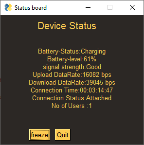

# Smarter jiofi Version 0.1
Gui application will show your jiofi status and Alert user to plug and unplug charger at low and high battery.

Works with windows machine and you should be connected to JIOFI ( tested with JMR541)

Instructions:
Step 1: run "pip install -r requirements.txt" from current directory
	(optional step)
	run "pip install -r myenv.txt" to replicate my environment

Step 2: run "python Smart jiofi.py" in CMD in Current directory

Optional: 

	Use pyinstaller to convert this program into EXE file. 
	

# What can you expect in next version 

	Connection Status:
		APN, Signal strength value, IP address v4 and v6, gateway, DNS
	Network info:
		SSID, Mac Address, channel, Bandwidth, security, Total Upload and download
	Jiofi System Metrics:
		System Usage, Memory Usage, uplink rate and downlink rate [ with realtime graphs ]
    

